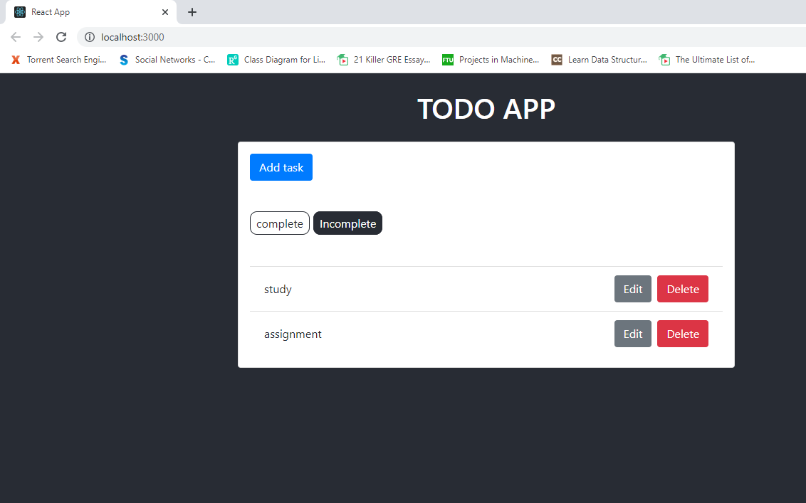
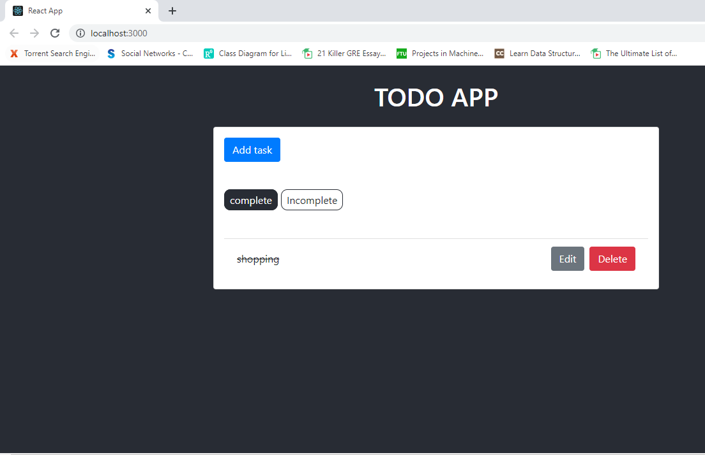

# ToDo-App

For this application, React serves as the frontend, or client-side framework, handling the user interface and getting and setting data via requests to the Django backend, which is an API built using the Django REST framework.

### Screenshots

  

  

